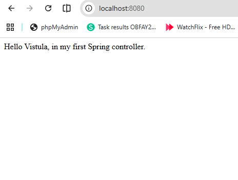
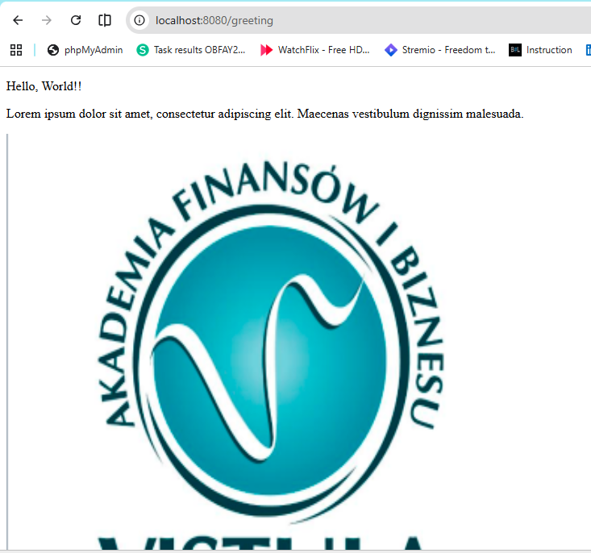

First Spring Boot Project – Task 1
Project Overview

This project is part of Spring Framework Apps – Task 1.
The goal is to build a simple Spring Boot application from scratch, create a controller, and handle HTTP requests.

The application demonstrates:

Basic Spring Boot setup
Creating a controller
Handling HTTP requests
Returning responses using @ResponseBody
Simple MVC structure with a view (HTML page)
Technologies Used
Java
Spring Boot
Maven
Spring Web
Thymeleaf
Lombok (optional)
Project Setup
1. Generate Project

Project was created using:
https://start.spring.io/

Configuration:

Project: Maven
Language: Java
Spring Boot: Latest stable version

Dependencies:

Spring Web
Thymeleaf
Lombok
2. Run the Application

After importing into IntelliJ:

mvn spring-boot:run

Or run the main class directly.

The application starts on:
http://localhost:8080

Features
1. Simple HTTP Response

A basic endpoint that returns text using @ResponseBody.

Example:

@GetMapping("/")
@ResponseBody
public String home() {
    return "Hello World!";
}

Access in browser:
http://localhost:8080/

2. MVC View (Thymeleaf)

The project also returns a view (HTML page).

Controller example:

@GetMapping("/greeting")
public String greeting() {
    return "greeting";
}

This loads:
templates/greeting.html

Frontend (Thymeleaf)
HTML file: greeting.html
Displays simple content (text + image)
Uses Thymeleaf templating engine

Example content:

<h1>Hello from Spring Boot!</h1>

Testing the Application
Using Browser

Home endpoint:
http://localhost:8080/

Greeting page:
http://localhost:8080/greeting

Key Concepts Learned
How Spring Boot works
Creating a controller using @Controller
Handling requests with @GetMapping
Using @ResponseBody
Basic MVC pattern (Controller → View)
Serving HTML with Thymeleaf
Screenshots

Add screenshots to demonstrate:

Application running in IntelliJ
Browser output (home endpoint)
Greeting page

Example:

